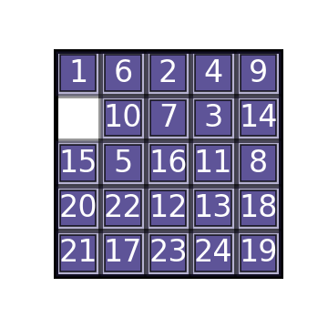
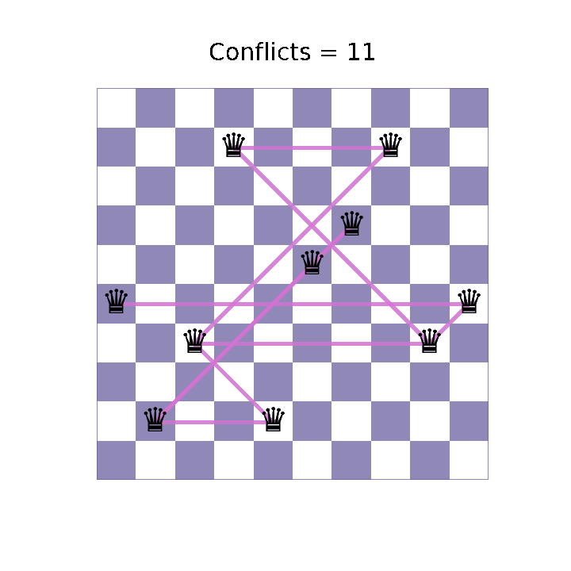
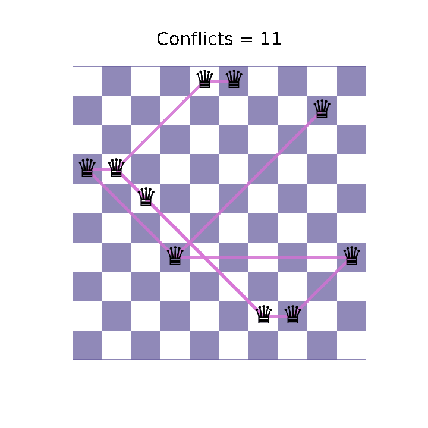
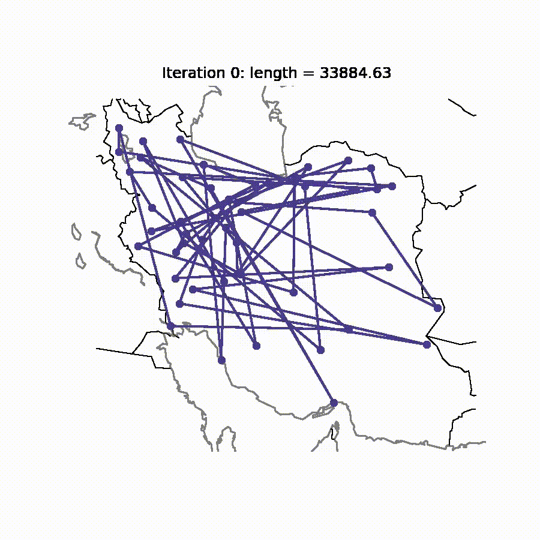

## Local Search

### N-Puzzle
                                                             

  
   Example solution path found by A-Star for 25-puzzle problem.

### Hill Climbing
                                                             

  
   Example solution found by hill climbing for 10-Queens problem.

### Simulated Annealing
                                                             

  
   Example solution found by simulated annealing for 10-Queens problem.

### Genetic Algorithm
                                                             

  
   Example solution found by genetic algorithm for 100-Queens problem.

### Simulated Annealing (TSP)
                                                             

  
   Example solution found by simulated annealing for TSP problem (for 50 cities).

